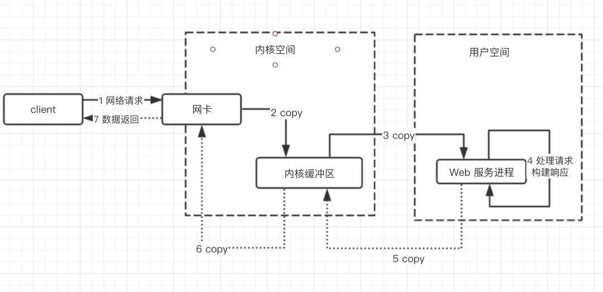

> 之前写的被mac的文件夹覆盖“特性”覆盖没了，我很心痛T_T

- socket的概念
- socket基本实现
- socket面临的问题-网络io的原因
- 介绍五种网络io模型
- 目前已实现的socket方式
- 整理遇到的问题

# 一、socket的概念

​		我们知道通过ip地址、mac地址和arp协议，可以实现计算机之间的定位，然后通过tcp/udp可以实现计算机端口之间的通信。从上图可以看出，所谓socket其实不过是对底层的tcp/udp进行了封装，并没有在原有的计算机网络结构上多出什么。之所以需要socket，也可以从这个词本身的意思看出来，socket一般指的是插座，当我们将底层协议封装好之后，应用层再去调用时就会方便很多，可以提高开发的效率，这时应用层不再关注传输层的细节，如同电器的插头插到插座就可以得到电力一样，应用层只需要调用socket就可以获取到数据。

# 二、socket基本实现

由上图可以看出，计算机从网卡处获取到数据包之后需要两次copy，在数据拷贝到用户空间之前，程序一直处于阻塞的状态。